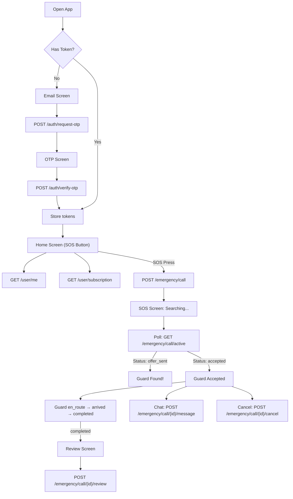

# 📱 User App — Complete Flutter Integration Guide

> **Base URL**: `https://safe-city-back-7c8ed50edd7d.herokuapp.com/api/v1`  
> **Auth**: All endpoints (except auth) require `Authorization: Bearer <access_token>` header

---

## App Architecture Overview

```
lib/
├── models/
│   ├── user.dart
│   ├── emergency_call.dart
│   ├── notification.dart
│   ├── payment.dart
│   └── settings.dart
├── services/
│   ├── auth_service.dart
│   ├── user_service.dart
│   ├── emergency_service.dart
│   ├── notification_service.dart
│   ├── payment_service.dart
│   └── support_service.dart
├── screens/
│   ├── auth/
│   │   ├── email_screen.dart
│   │   └── otp_screen.dart
│   ├── home/
│   │   └── home_screen.dart          (SOS button)
│   ├── emergency/
│   │   ├── sos_screen.dart           (searching/tracking)
│   │   ├── call_chat_screen.dart
│   │   └── review_screen.dart
│   ├── profile/
│   │   ├── profile_screen.dart
│   │   └── settings_screen.dart
│   ├── notifications/
│   │   └── notifications_screen.dart
│   ├── payments/
│   │   └── payment_history_screen.dart
│   └── support/
│       ├── faq_screen.dart
│       └── contacts_screen.dart
```

---

## Complete User Flow



---

## 1. Authentication

### 1.1 Request OTP

```
POST /auth/request-otp
```

**Request:**
```json
{ "email": "user@example.com" }
```

**Response (200):**
```json
{
  "success": true,
  "message": "OTP sent successfully",
  "data": { "email": "user@example.com" }
}
```

### 1.2 Verify OTP → Get Tokens

```
POST /auth/verify-otp
```

**Request:**
```json
{
  "email": "user@example.com",
  "code": "1234"
}
```

**Response (200):**
```json
{
  "access_token": "eyJhbGciOi...",
  "refresh_token": "eyJhbGciOi...",
  "token_type": "bearer",
  "expires_in": 1800,
  "role": "user"
}
```

### 1.3 Refresh Token

```
POST /auth/refresh
```

**Request:**
```json
{ "refresh_token": "eyJhbGciOi..." }
```

**Response:** Same as verify-otp.

### Dart Implementation

```dart
// lib/services/auth_service.dart
class AuthService {
  final Dio _dio;
  AuthService(this._dio);

  Future<Map<String, dynamic>> requestOTP(String email) async {
    final resp = await _dio.post('/auth/request-otp', data: {'email': email});
    return resp.data;
  }

  Future<TokenResponse> verifyOTP(String email, String code) async {
    final resp = await _dio.post('/auth/verify-otp', data: {
      'email': email, 'code': code,
    });
    return TokenResponse.fromJson(resp.data);
  }

  Future<TokenResponse> refreshToken(String refreshToken) async {
    final resp = await _dio.post('/auth/refresh', data: {
      'refresh_token': refreshToken,
    });
    return TokenResponse.fromJson(resp.data);
  }
}
```

> [!IMPORTANT]
> Store `access_token` and `refresh_token` in `flutter_secure_storage`. Add a Dio interceptor that automatically refreshes the token on 401 responses.

---

## 2. User Profile

### 2.1 Get Profile

```
GET /user/me
Authorization: Bearer <token>
```

**Response:**
```json
{
  "id": 1,
  "email": "user@example.com",
  "phone": "+77001234567",
  "role": "user",
  "full_name": "Алексей",
  "avatar_url": null,
  "is_verified": true,
  "created_at": "2026-03-25T10:00:00Z",
  "subscription": {
    "id": 1,
    "status": "active",
    "plan_type": "monthly",
    "started_at": "2026-03-25T10:00:00Z",
    "expires_at": "2026-04-25T10:00:00Z"
  }
}
```

### 2.2 Update Profile

```
PATCH /user/me
```

**Request (all fields optional):**
```json
{
  "full_name": "Алексей Иванов",
  "phone": "+77001234567",
  "avatar_url": "https://..."
}
```

### 2.3 Update Location (background)

```
POST /user/location
```

**Request:**
```json
{ "latitude": 43.238949, "longitude": 76.945526 }
```

> [!TIP]
> Send location updates every 30–60 seconds using a background location plugin like `geolocator`. This is needed so the backend can find the nearest guard when SOS is pressed.

### 2.4 Get Subscription

```
GET /user/subscription
```

### 2.5 Delete Account

```
DELETE /user/me
```

---

## 3. Emergency (SOS) — The Core Feature

### 3.1 Create Emergency Call (SOS Button)

```
POST /emergency/call
```

**Request:**
```json
{
  "latitude": 43.238949,
  "longitude": 76.945526,
  "address": "ул. Абая 52, Алматы"
}
```

**Response:**
```json
{
  "id": 42,
  "status": "offer_sent",
  "latitude": 43.238949,
  "longitude": 76.945526,
  "address": "ул. Абая 52, Алматы",
  "created_at": "2026-03-30T10:00:00Z",
  "accepted_at": null,
  "en_route_at": null,
  "arrived_at": null,
  "completed_at": null,
  "security_company": {
    "id": 1,
    "name": "КүзетPRO",
    "logo_url": "https://...",
    "phone": "+77001234567"
  }
}
```

> [!IMPORTANT]
> The backend immediately searches for the nearest guard and assigns them. Status will be `offer_sent` if a guard was found, or `searching` if none available yet.

### 3.2 Poll Active Call Status

```
GET /emergency/call/active
```

**Use this endpoint to poll every 3–5 seconds** to track the call lifecycle on the user's screen:

| Status | What to show the user |
|--------|----------------------|
| `searching` | "Ищем ближайшего охранника..." with spinner |
| `offer_sent` | "Охранник найден, ожидаем подтверждение..." |
| `accepted` | "Охранник принял вызов!" — show guard info |
| `en_route` | "Охранник выехал" — show ETA on map |
| `arrived` | "Охранник на месте" |
| `completed` | Transition to Review Screen |
| `cancelled_by_user` | Return to Home |
| `cancelled_by_system` | "Охранники недоступны" — show error |

### 3.3 Get Specific Call

```
GET /emergency/call/{call_id}
```

### 3.4 Cancel Call

```
POST /emergency/call/{call_id}/cancel
```

**Request:**
```json
{ "reason": "Ложная тревога" }
```

### 3.5 Call History

```
GET /emergency/history?limit=20&offset=0
```

**Response:**
```json
{
  "calls": [
    {
      "id": 42,
      "status": "completed",
      "created_at": "2026-03-30T10:00:00Z",
      "completed_at": "2026-03-30T10:15:00Z",
      "duration_seconds": 900
    }
  ],
  "total": 5
}
```

### Dart Implementation

```dart
// lib/services/emergency_service.dart
class EmergencyService {
  final Dio _dio;
  EmergencyService(this._dio);

  /// SOS button pressed
  Future<EmergencyCall> createCall(double lat, double lng, String? address) async {
    final resp = await _dio.post('/emergency/call', data: {
      'latitude': lat, 'longitude': lng, 'address': address,
    });
    return EmergencyCall.fromJson(resp.data);
  }

  /// Poll this every 3-5 seconds on the SOS screen
  Future<EmergencyCall?> getActiveCall() async {
    try {
      final resp = await _dio.get('/emergency/call/active');
      return EmergencyCall.fromJson(resp.data);
    } on DioException catch (e) {
      if (e.response?.statusCode == 404) return null;
      rethrow;
    }
  }

  Future<EmergencyCall> cancelCall(int callId, String? reason) async {
    final resp = await _dio.post('/emergency/call/$callId/cancel', data: {
      'reason': reason,
    });
    return EmergencyCall.fromJson(resp.data);
  }

  Future<CallHistory> getHistory({int limit = 20, int offset = 0}) async {
    final resp = await _dio.get('/emergency/history', 
      queryParameters: {'limit': limit, 'offset': offset});
    return CallHistory.fromJson(resp.data);
  }
}
```

---

## 4. In-Call Chat

### 4.1 Send Message

```
POST /emergency/call/{call_id}/message
```

**Request:**
```json
{ "message": "Я у второго подъезда" }
```

### 4.2 Get Messages

```
GET /emergency/call/{call_id}/messages
```

**Response:**
```json
{
  "messages": [
    {
      "id": 1,
      "call_id": 42,
      "sender_type": "user",
      "sender_id": 1,
      "message": "Я у второго подъезда",
      "created_at": "2026-03-30T10:05:00Z"
    },
    {
      "id": 2,
      "call_id": 42,
      "sender_type": "guard",
      "sender_id": 5,
      "message": "Понял, еду к вам",
      "created_at": "2026-03-30T10:05:30Z"
    }
  ],
  "total": 2
}
```

> [!TIP]
> Poll `GET /messages` every 3 seconds during an active call. Check `sender_type` to distinguish between user messages (right-aligned) and guard messages (left-aligned) in the chat UI.

---

## 5. Review (After Call Completed)

```
POST /emergency/call/{call_id}/review
```

**Request:**
```json
{
  "rating": 5,
  "comment": "Приехал быстро, всё решил!"
}
```

> [!NOTE]
> `rating` must be 1–5. `comment` is optional. Can only be submitted once per call, and only after the call status is `completed`.

---

## 6. Notifications

### 6.1 Register Device (for Push Notifications)

```
POST /user/device
```

**Request:**
```json
{
  "device_token": "fcm_token_..." ,
  "device_type": "android",
  "device_model": "Samsung S21",
  "app_version": "1.0.0"
}
```

### 6.2 Implementation

The app uses `PushNotificationService` to initialize Firebase and listen for messages. When a notification is tapped, it uses the `rootNavigatorKey` to transition the UI.

**Handling Logic:**
```dart
void _handleNotificationPayload(Map<String, dynamic> data) {
  final context = rootNavigatorKey.currentContext;
  if (context != null) {
    if (data.containsKey('call_id')) {
      GoRouter.of(context).push('/emergency');
    }
  }
}
```

### 6.3 Get Notification History

```
GET /notifications?limit=50&offset=0
```

**Response:**
```json
{
  "notifications": [
    {
      "id": 1,
      "title": "Вызов завершён",
      "body": "Ваш вызов #42 успешно завершён",
      "type": "call_update",
      "data": "{\"call_id\": 42, \"status\": \"completed\"}",
      "is_read": false,
      "created_at": "2026-03-30T10:15:00Z"
    }
  ],
  "total": 10,
  "unread_count": 3
}
```

### 6.2 Mark as Read

```
PATCH /notifications/{notification_id}/read
```

### 6.3 Mark All as Read

```
POST /notifications/read-all
```

---

## 7. Payment History

```
GET /payments/history?limit=50&offset=0
```

---

## 8. User Settings

### 8.1 Get Settings

```
GET /user/settings
```

**Response:**
```json
{
  "notifications_enabled": true,
  "call_sound_enabled": true,
  "vibration_enabled": true,
  "language": "ru",
  "dark_theme_enabled": true
}
```

### 8.2 Update Settings

```
PATCH /user/settings
```

**Request (all optional):**
```json
{
  "notifications_enabled": false,
  "language": "kk"
}
```

---

## 9. FAQ & Support

### 9.1 Get FAQ

```
GET /support/faq?target=user
```

### 9.2 Get Support Contacts

```
GET /support/contacts
```

**Response:**
```json
{
  "whatsapp": "+77001234567",
  "phone": "+77001234567",
  "email": "support@safecity.kz"
}
```

---

## Screen → Endpoint Mapping (Quick Reference)

| Screen | Endpoints Used |
|--------|---------------|
| **Login / Email** | `POST /auth/request-otp` |
| **OTP Verification** | `POST /auth/verify-otp` |
| **Home (SOS Button)** | `GET /user/me`, `GET /user/subscription`, `POST /user/location` |
| **SOS Active** | `POST /emergency/call`, `GET /emergency/call/active` (poll) |
| **In-Call Chat** | `POST /emergency/call/{id}/message`, `GET /emergency/call/{id}/messages` |
| **Review** | `POST /emergency/call/{id}/review` |
| **Call History** | `GET /emergency/history` |
| **Profile** | `GET /user/me`, `PATCH /user/me` |
| **Settings** | `GET /user/settings`, `PATCH /user/settings` |
| **Notifications** | `GET /notifications`, `PATCH /notifications/{id}/read`, `POST /notifications/read-all` |
| **Payment History** | `GET /payments/history` |
| **FAQ** | `GET /support/faq?target=user` |
| **Support** | `GET /support/contacts` |
| **Cancel Call** | `POST /emergency/call/{id}/cancel` |
| **Delete Account** | `DELETE /user/me` |

---

## Total Endpoints: 19

| # | Method | Path |
|---|--------|------|
| 1 | `POST` | `/auth/request-otp` |
| 2 | `POST` | `/auth/verify-otp` |
| 3 | `POST` | `/auth/refresh` |
| 4 | `GET` | `/user/me` |
| 5 | `PATCH` | `/user/me` |
| 6 | `DELETE` | `/user/me` |
| 7 | `POST` | `/user/location` |
| 8 | `GET` | `/user/subscription` |
| 9 | `GET` | `/user/settings` |
| 10 | `PATCH` | `/user/settings` |
| 11 | `POST` | `/emergency/call` |
| 12 | `GET` | `/emergency/call/active` |
| 13 | `GET` | `/emergency/call/{call_id}` |
| 14 | `POST` | `/emergency/call/{call_id}/cancel` |
| 15 | `GET` | `/emergency/history` |
| 16 | `POST` | `/emergency/call/{call_id}/message` |
| 17 | `GET` | `/emergency/call/{call_id}/messages` |
| 18 | `POST` | `/emergency/call/{call_id}/review` |
| 19 | `GET` | `/notifications` |
| 20 | `PATCH` | `/notifications/{id}/read` |
| 21 | `POST` | `/notifications/read-all` |
| 22 | `GET` | `/payments/history` |
| 23 | `GET` | `/support/faq` |
| 24 | `GET` | `/support/contacts` |
